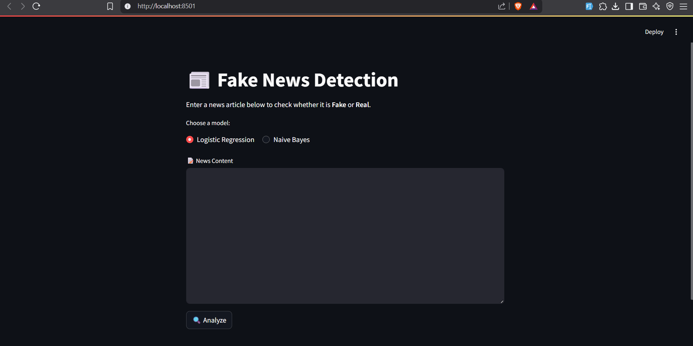
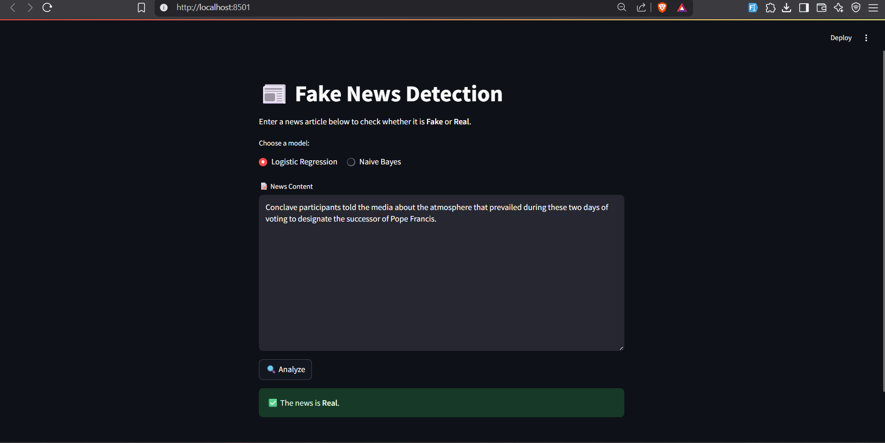

# 📰 Fake News Detection Web App

This project is a web-based Fake News Detection system built with **Streamlit** and trained using **Logistic Regression** and **Naive Bayes** models. It uses **TF-IDF vectorization** and processes real and fake news articles to classify them accurately.

---

## 🚀 Features

- Binary classification: **Real vs Fake news**
- Choose between **Logistic Regression** and **Naive Bayes**
- Cleaned and preprocessed news data
- Streamlit interface for interactive usage
- Trained models and vectorizer stored in `models/` folder
- Custom preprocessing with **NLTK**, **lemmatization**, and **stopword removal**

---

## 📁 Project Structure

```
.
├── app.py                # Streamlit app for real-time prediction
├── train_model.py        # Script to clean data, train models and save them
├── data/
│   ├── Fake.csv          # Dataset containing fake news
│   └── True.csv          # Dataset containing real news
├── models/
│   ├── logistic_model.pkl
│   ├── naive_bayes.pkl
│   └── vectorizer.pkl
└── README.md             # Project documentation
```

---

## 📷 Screenshot





---

## 🧪 How It Works

1. Load datasets from `data/Fake.csv` and `data/True.csv`
2. Label them (Fake=1, Real=0)
3. Preprocess text:
   - Lowercasing
   - Remove punctuation
   - Remove stopwords
   - Lemmatization
4. Train models using TF-IDF + Logistic Regression / Naive Bayes
5. Save models in `models/` using `pickle`
6. Load in Streamlit to predict and visualize results interactively

---

## 📦 Installation

### 1. Clone the repository

```bash
git clone https://github.com/your-username/fake-news-detector.git
cd fake-news-detector
```

### 2. Create a virtual environment

```bash
python -m venv .venv
# Activate it:
# On Windows:
.venv\Scripts\activate
# On macOS/Linux:
source .venv/bin/activate
```

### 3. Install dependencies

```bash
pip install --upgrade pip setuptools wheel
pip install -r requirements.txt
```

### 4. Run the project

```bash
python train_model.py     # Preprocesses data, trains and saves models
streamlit run app.py      # Launches the web app
```

---

## ✅ Requirements

Here’s the content for `requirements.txt`:

```
streamlit
pandas
numpy
scikit-learn
nltk
```

---

## 🧠 Models Used

- **Logistic Regression** – fast linear classifier
- **Multinomial Naive Bayes** – well-suited for word frequencies
- **TF-IDF Vectorizer** – converts text to numerical vectors

---

## 📂 Datasets

Used Kaggle's [Fake and Real News Dataset](https://www.kaggle.com/clmentbisaillon/fake-and-real-news-dataset)

Place both CSVs inside the `data/` directory:

- `data/Fake.csv`
- `data/True.csv`

---


---

## 🙋‍♂️ Author

- **Omar Laraje**  
  [GitHub](https://github.com/omarlr-pro)  
  [LinkedIn](https://www.linkedin.com/in/omar-laraje-998827233/)  
  
