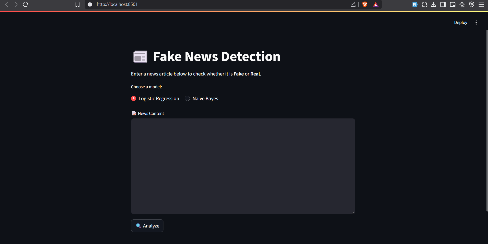
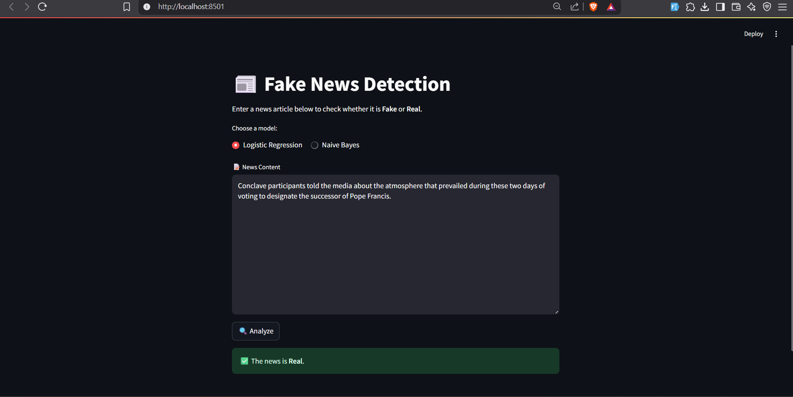

# Détection de Fake News - Application Web

Application web de détection de fausses informations construite avec Streamlit et entraînée avec des modèles de Régression Logistique et Naive Bayes. Elle utilise la vectorisation TF-IDF et traite des articles d'actualité réels et faux pour les classifier avec précision.

## Mots-clés

`Python` · `Machine Learning` · `NLP` · `Détection Fake News` · `Streamlit` · `Régression Logistique` · `Naive Bayes` · `TF-IDF` · `NLTK` · `Classification de Texte` · `Traitement du Langage Naturel` · `Intelligence Artificielle` · `Data Science`

## Table des Matières

- [Caractéristiques](#caractéristiques)
- [Démo](#démo)
- [Structure du Projet](#structure-du-projet)
- [Comment ça Fonctionne](#comment-ça-fonctionne)
- [Installation](#installation)
- [Utilisation](#utilisation)
- [Modèles Utilisés](#modèles-utilisés)
- [Datasets](#datasets)
- [Technologies](#technologies)
- [Performance](#performance)
- [Améliorations Futures](#améliorations-futures)
- [Contribution](#contribution)
- [Licence](#licence)
- [Auteur](#auteur)

## Caractéristiques

- Classification binaire : Nouvelles réelles vs fausses nouvelles
- Choix entre Régression Logistique et Naive Bayes
- Données d'actualité nettoyées et prétraitées
- Interface Streamlit pour une utilisation interactive
- Modèles entraînés et vectoriseur stockés dans le dossier `models/`
- Prétraitement personnalisé avec NLTK, lemmatisation et suppression des mots vides
- Prédictions en temps réel
- Visualisation des résultats avec probabilités de confiance

## Démo

### Interface Principale


### Résultat de Prédiction


### Analyse Détaillée


## Structure du Projet
```
fake-news-detector/
│
├── app.py                # Application Streamlit pour prédiction en temps réel
├── train_model.py        # Script pour nettoyer données, entraîner et sauvegarder modèles
│
├── data/
│   ├── Fake.csv          # Dataset contenant les fausses nouvelles
│   └── True.csv          # Dataset contenant les vraies nouvelles
│
├── models/
│   ├── logistic_model.pkl    # Modèle de régression logistique sauvegardé
│   ├── naive_bayes.pkl       # Modèle Naive Bayes sauvegardé
│   └── vectorizer.pkl        # Vectoriseur TF-IDF sauvegardé
│
├── assets/
│   └── screenshots/      # Captures d'écran de l'application
│
├── requirements.txt      # Dépendances Python
└── README.md            # Documentation du projet
```

## Comment ça Fonctionne

### Pipeline de Traitement des Données

1. **Chargement des Données**
   - Charge les datasets depuis `data/Fake.csv` et `data/True.csv`
   - Étiquetage des données (Fake=1, Real=0)

2. **Prétraitement du Texte**
   - Conversion en minuscules
   - Suppression de la ponctuation
   - Suppression des mots vides (stopwords)
   - Lemmatisation des mots
   - Nettoyage des caractères spéciaux

3. **Vectorisation**
   - Transformation du texte en vecteurs numériques avec TF-IDF
   - Extraction des caractéristiques pertinentes

4. **Entraînement des Modèles**
   - Entraînement avec Régression Logistique
   - Entraînement avec Multinomial Naive Bayes
   - Évaluation des performances

5. **Sauvegarde**
   - Sauvegarde des modèles dans `models/` avec pickle
   - Conservation du vectoriseur pour usage futur

6. **Prédiction Interactive**
   - Chargement dans Streamlit
   - Prédiction et visualisation des résultats en temps réel

## Installation

### Prérequis

- Python 3.8 ou supérieur
- pip (gestionnaire de paquets Python)
- Environnement virtuel (recommandé)

### Étape 1 : Cloner le Dépôt
```bash
git clone https://github.com/omarlr-pro/fake-news-detector.git
cd fake-news-detector
```

### Étape 2 : Créer un Environnement Virtuel
```bash
python -m venv .venv
```

**Activer l'environnement :**

Sur Windows :
```bash
.venv\Scripts\activate
```

Sur macOS/Linux :
```bash
source .venv/bin/activate
```

### Étape 3 : Installer les Dépendances
```bash
pip install --upgrade pip setuptools wheel
pip install -r requirements.txt
```

### Étape 4 : Télécharger les Ressources NLTK
```python
python -c "import nltk; nltk.download('stopwords'); nltk.download('wordnet'); nltk.download('omw-1.4')"
```

## Utilisation

### 1. Entraîner les Modèles

Prétraite les données, entraîne et sauvegarde les modèles :
```bash
python train_model.py
```

Cette commande va :
- Charger et nettoyer les datasets
- Entraîner les modèles de classification
- Sauvegarder les modèles et le vectoriseur dans `models/`
- Afficher les métriques de performance

### 2. Lancer l'Application Web

Lance l'interface Streamlit :
```bash
streamlit run app.py
```

L'application s'ouvrira automatiquement dans votre navigateur par défaut à l'adresse `http://localhost:8501`

### 3. Utiliser l'Application

1. Sélectionnez le modèle (Régression Logistique ou Naive Bayes)
2. Saisissez ou collez le texte d'un article
3. Cliquez sur "Analyser"
4. Consultez le résultat avec le score de confiance

## Modèles Utilisés

### Régression Logistique

- Classificateur linéaire rapide et efficace
- Excellent pour la classification binaire
- Performances élevées sur les données textuelles
- Temps d'entraînement rapide

### Multinomial Naive Bayes

- Bien adapté aux fréquences de mots
- Algorithme probabiliste
- Très efficace avec des données textuelles
- Faible complexité computationnelle

### Vectoriseur TF-IDF

- Term Frequency-Inverse Document Frequency
- Convertit le texte en vecteurs numériques
- Donne plus de poids aux mots importants
- Réduit l'importance des mots communs

## Datasets

Le projet utilise le dataset Kaggle [Fake and Real News Dataset](https://www.kaggle.com/clmentbisaillon/fake-and-real-news-dataset)

### Composition des Données

- **Fake.csv** : Articles de fausses nouvelles
- **True.csv** : Articles de vraies nouvelles
- Format : CSV avec colonnes title, text, subject, date

### Préparation des Données

Placez les deux fichiers CSV dans le répertoire `data/` :
- `data/Fake.csv`
- `data/True.csv`

## Technologies

### Langages et Frameworks

- **Python 3.8+** : Langage de programmation principal
- **Streamlit** : Framework pour l'interface web
- **Scikit-learn** : Bibliothèque de machine learning
- **NLTK** : Traitement du langage naturel
- **Pandas** : Manipulation de données
- **NumPy** : Calculs numériques

### Bibliothèques Principales
```txt
streamlit>=1.28.0
pandas>=2.0.0
numpy>=1.24.0
scikit-learn>=1.3.0
nltk>=3.8.0
pickle-mixin>=1.0.2
```

## Performance

### Métriques d'Évaluation

Les modèles sont évalués sur :
- Précision (Accuracy)
- Précision (Precision)
- Rappel (Recall)
- F1-Score
- Matrice de confusion

### Résultats Attendus

- Précision moyenne : >90%
- Temps de prédiction : <1 seconde
- Support multilingue : Principalement anglais

## Améliorations Futures

### Fonctionnalités Planifiées

- Support multilingue (français, arabe, espagnol)
- Analyse de sentiment additionnelle
- Détection de sources
- API REST pour intégration
- Base de données pour historique des prédictions
- Modèles de deep learning (BERT, Transformers)
- Détection de biais dans les articles
- Score de fiabilité des sources
- Export des résultats en PDF/CSV
- Dashboard d'analyse statistique

### Optimisations Techniques

- Mise en cache des prédictions
- Amélioration de la vitesse de traitement
- Support de fichiers batch
- Interface mobile responsive
- Tests unitaires et d'intégration

## Dépannage

### Problème : Erreur NLTK Resources
```bash
# Solution : Télécharger manuellement les ressources
python -m nltk.downloader stopwords wordnet omw-1.4
```

### Problème : Modèles non trouvés
```bash
# Solution : Re-entraîner les modèles
python train_model.py
```

### Problème : Streamlit ne démarre pas
```bash
# Solution : Vérifier l'installation
pip install --upgrade streamlit
streamlit hello
```

## Contribution

Les contributions sont les bienvenues ! Voici comment participer :

### Comment Contribuer

1. Forkez le projet
2. Créez une branche pour votre fonctionnalité (`git checkout -b feature/NouvelleFonctionnalité`)
3. Committez vos changements (`git commit -m 'Ajout de NouvelleFonctionnalité'`)
4. Poussez vers la branche (`git push origin feature/NouvelleFonctionnalité`)
5. Ouvrez une Pull Request

### Lignes Directrices

- Suivre les conventions de code Python (PEP 8)
- Ajouter des tests pour les nouvelles fonctionnalités
- Documenter le code et les fonctions
- Mettre à jour le README si nécessaire

## Licence

Ce projet est sous licence MIT. Voir le fichier [LICENSE](LICENSE) pour plus de détails.

Vous êtes libre d'utiliser, modifier et distribuer ce projet avec attribution appropriée.

## Auteur

**Omar Laraje**

- GitHub : [@omarlr-pro](https://github.com/omarlr-pro)
- LinkedIn : [Omar Laraje](https://www.linkedin.com/in/omar-laraje-998827233/)
- Rôle : Étudiant en Data Science et Génie Logiciel
- Localisation : Rabat, Maroc

## Remerciements

- Dataset fourni par Kaggle
- Bibliothèques open-source : Streamlit, Scikit-learn, NLTK
- Communauté Python et Machine Learning
- Inspiré par la recherche en détection de désinformation

## Citations et Références

Si vous utilisez ce projet dans vos recherches, veuillez le citer :
```
@software{fake_news_detector,
  author = {Omar Laraje},
  title = {Fake News Detection Web App},
  year = {2025},
  url = {https://github.com/omarlr-pro/fake-news-detector}
}
```

## Support

Pour toute question ou problème :
- Ouvrez une [issue](https://github.com/omarlr-pro/fake-news-detector/issues)
- Contactez-moi via [LinkedIn](https://www.linkedin.com/in/omar-laraje-998827233/)

---

**Développé avec passion pour combattre la désinformation**

**Mettez une étoile si ce projet vous a été utile !**
